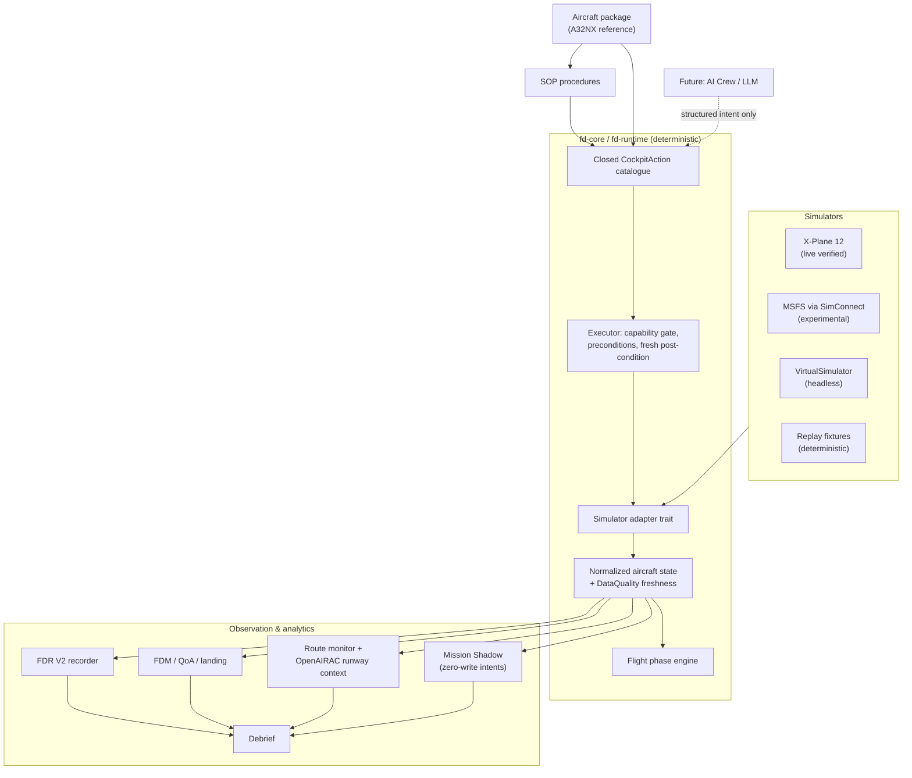

# FlightdeckOS

[](https://github.com/bobberdolle1/FlightdeckOS/actions/workflows/ci.yml)
[](LICENSE)

Simulator-independent aviation runtime and experimental flight-automation
platform: flight-data observation and recording, navigation context, aircraft
capability discovery, deterministic procedures, safe cockpit actions — built
as the foundation for a future intelligent virtual crew.

**Status: experimental.** The deterministic runtime, headless flight lab and
X-Plane 12 integration are real and tested. Autonomous flight, AI crew and
passenger mode do not exist yet. See [Current status](#current-status) and
[docs/STATUS.md](docs/STATUS.md) for exactly what is proven and what is not.

## Why FlightdeckOS

Different simulators and aircraft expose different APIs, system models and
procedures. FlightdeckOS normalizes those differences into one deterministic
runtime that can observe, analyze and — through validated capabilities only —
eventually control supported aircraft:

- one normalized aircraft state model with explicit data-quality semantics;
- one closed, typed action catalogue instead of raw variable writes;
- one procedure/mission layer that runs identically headless and live;
- navigation context (airports, runways, routes) from
  [OpenAIRAC](https://github.com/bobberdolle1/open-airac) data.

The long-term direction is an intelligent virtual crew. The runtime
foundation is deliberately **deterministic software first** — an LLM, when it
arrives, will emit structured intents into validated tools, never raw
simulator writes. See [docs/SAFETY_MODEL.md](docs/SAFETY_MODEL.md).

## Current status

| Capability | Status |
| --- | --- |
| X-Plane 12 live UDP telemetry | LIVE VERIFIED (12.4.3) |
| X-Plane Web API discovery + command transport | LIVE VERIFIED (12.4.3) |
| First closed cockpit action (`SetBeacon`) with fresh post-condition verification | LIVE VERIFIED |
| Live flight observatory (`fd observe`: FDR, phase, route, debrief) | SHORT LIVE SESSION VERIFIED — full-flight pending |
| FDR V2 (versioned streaming recorder) | OFFLINE + SHORT LIVE VERIFIED |
| Replay determinism | OFFLINE VERIFIED |
| FDM (development analytics) | OFFLINE/REPLAY VERIFIED |
| Quality of Approach / landing analytics | OFFLINE/REPLAY VERIFIED |
| Route monitor + runway awareness | HEADLESS/OFFLINE VERIFIED |
| OpenAIRAC airport/runway context | VERIFIED (local world store, read-only) |
| Mission Shadow (zero-write intent observation) | OFFLINE VERIFIED — no live flight yet |
| Generic Aircraft mode (unknown aircraft) | OFFLINE VERIFIED |
| Aircraft packages (A32NX reference) | OFFLINE VERIFIED |
| SOP primitives | OFFLINE VERIFIED |
| Headless Flight Lab (VirtualSimulator, scenarios, fault injection) | OFFLINE VERIFIED |
| MSFS SimConnect foundation | EXPERIMENTAL — never live-validated |
| Full live-flight observation | PENDING |
| Autonomous flight | PLANNED — not implemented |
| AI Crew / LLM integration | PLANNED — gateway client only |
| Passenger Mode | PLANNED |

"VERIFIED" always means: covered by tests in this repository at the stated
level. Live claims come from real X-Plane sessions on the development
machine; headless claims never imply simulator behavior. Details:
[docs/STATUS.md](docs/STATUS.md).

## X-Plane live integration

FlightdeckOS has been tested against real X-Plane 12.4.3 sessions. Verified
properties:

- live normalized telemetry over native UDP (RREF subscriptions);
- aircraft identity with provenance;
- capability evidence per transport;
- X-Plane Local Web API discovery (session-scoped resource ids);
- one closed cockpit action end-to-end:

```text
CockpitAction::SetBeacon
  → LiveWriteGuard (default DISABLED, explicit --allow-write)
  → capability + precondition gate
  → X-Plane Web API command
  → fresh post-dispatch UDP telemetry
  → observed post-condition → Verified
  → restoration to the original cockpit state through the same path
```

This proves the **safe control architecture**. It does not prove autonomous
flight. Live writes are disabled by default and the observation tooling
(`fd observe`) cannot write at all.

## Flight observatory

`fd observe` watches a real flight and produces a structured debrief without
touching the simulator: FDR V2 recording, flight-session lifecycle, flight
phase, FDM analytics, route/runway context from OpenAIRAC, data-quality
summary. The infrastructure plus a short live session are verified; a full
end-to-end live flight observation is still pending — the local X-Plane
instance became unstable during the validation campaign. See
[docs/XPLANE.md](docs/XPLANE.md) and [docs/FLIGHT_DATA.md](docs/FLIGHT_DATA.md).

## Architecture



Full description: [docs/ARCHITECTURE.md](docs/ARCHITECTURE.md).

## Safety model

Project-defining invariants:

- upper layers have **no arbitrary simulator write API** — actions are a
  closed, typed catalogue (`CockpitAction`);
- live writes are **disabled by default** (`LiveWriteGuard`);
- capability evidence is required before any action may dispatch;
- success requires an **observed post-condition**, verified only from fresh
  post-dispatch state;
- unknown/stale/warming data is never silently trusted;
- Mission Shadow is **zero-write** by construction;
- a future LLM emits structured intents into validated tools — it will never
  write simulator variables directly.

See [docs/SAFETY_MODEL.md](docs/SAFETY_MODEL.md).

## Generic Aircraft mode

No aircraft profile does not make FlightdeckOS useless. For an unknown
aircraft (say, an unsupported IL-76 addon) it still provides generic
telemetry, flight phase, FDR, FDM, route monitoring and landing analytics
where data exists. Without trusted aircraft-specific knowledge it does **not**
invent systems state, SOP, cockpit actions or performance limits. Details:
[docs/AIRCRAFT_PROFILES.md](docs/AIRCRAFT_PROFILES.md).

## Simulator support

**X-Plane 12** is the primary live target: UDP telemetry plus the Local Web
API for resource discovery and discrete command control. No native XPLM
plugin is required for the proven slice.

**Microsoft Flight Simulator**: a SimConnect adapter foundation exists
(`fd-simconnect`), developed and tested offline only. MSFS is not a
live-validated target on the current development environment.

## Quick start

Requirements: Rust (stable, edition 2024). For live X-Plane features: X-Plane
12 on the same machine (default UDP port 49000).

```bash
# Build and test
cargo build --workspace
cargo test --workspace

# Run the headless reference mission (no simulator needed)
cargo run -p fd-app -- scenario --run scenarios/uuee_ulli_headless.toml

# Validate the reference aircraft package (fail-closed)
cargo run -p fd-app -- package --dir aircraft/a32nx

# Capability report (generic mode or with a package)
cargo run -p fd-app -- capabilities --package aircraft/a32nx

# Replay a recorded fixture deterministically
cargo run -p fd-app -- replay --fixture fixtures/replay_segment.jsonl

# Live X-Plane diagnostics (read-only telemetry monitoring)
cargo run -p fd-app -- xplane --monitor-secs 30

# Zero-write live flight observation (FDR + debrief; requires a running flight)
cargo run -p fd-app -- observe --monitor-secs 60 \
  --fdr-out traces/observe.jsonl --debrief-out traces/debrief.json
```

All commands are real; check `cargo run -p fd-app -- <command> --help` for
options. Live-write smoke actions on the `xplane` command require an explicit
`--allow-write` flag.

## Workspace

| Crate | Purpose |
| --- | --- |
| `fd-core` | Canonical state, units, phase engine, actions, capability, identity, geo |
| `fd-runtime` | Deterministic tick loop, ingest, executor, SOP flow, trace/replay |
| `fd-xplane` | X-Plane 12 UDP + Web API adapter, write guard, transport health |
| `fd-simconnect` | MSFS SimConnect adapter foundation (offline) |
| `fd-aircraft` | Aircraft packages, capability catalogues, action bindings |
| `fd-sop` | SOP procedure primitives and flows |
| `fd-fdm` | FDR recorder, session lifecycle, FDM, Quality of Approach/Landing |
| `fd-mission` | Mission controller, route/runway monitoring, Mission Shadow, intents |
| `fd-scenario` | Headless scenario engine, runner, reports |
| `fd-virtual` | Deterministic VirtualSimulator with fault injection |
| `fd-openairac` | OpenAIRAC world-store reader (read-only) + Gateway client |
| `fd-debrief` | Structured flight debrief model and builder |
| `fd-app` | CLI host (`replay`, `scenario`, `observe`, `xplane`, ...) |
| `fd-crew` | AI Crew runtime client (experimental) |

## Documentation

- [Architecture](docs/ARCHITECTURE.md) — components, boundaries, dependency direction
- [Current status](docs/STATUS.md) — evidence-backed capability snapshot
- [Roadmap](docs/ROADMAP.md) — what is next, in order
- [X-Plane integration](docs/XPLANE.md) — transports, safety, known limitations
- [Aircraft profiles](docs/AIRCRAFT_PROFILES.md) — packages, identity, Generic mode
- [Flight data](docs/FLIGHT_DATA.md) — FDR, FDM, QoA, debrief, data quality
- [Headless Flight Lab](docs/HEADLESS_FLIGHT_LAB.md) — virtual simulator, scenarios
- [Safety model](docs/SAFETY_MODEL.md) — the invariants that bound everything
- [Development](docs/DEVELOPMENT.md) — building, testing, contributing
- Historical design notes: [docs/history/](docs/history/)

## License

FlightdeckOS is licensed under [Apache-2.0](LICENSE). Third-party runtime
data (e.g. OpenAIRAC world datasets) remains under its own terms and is
read in place, never redistributed here.
